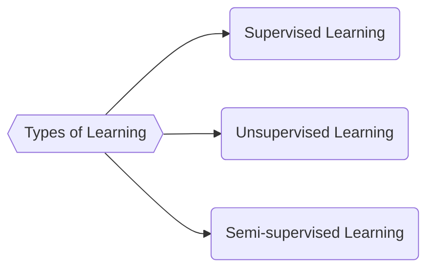

## Notion of Hypothesis $h_\theta$

When working with ML, the name of the game is to come up with a model that can accurately predict a set of outputs, for a set of inputs which the model has not seen before. 

Assume that there exists a dataset with $N$ data points, where $x_i \in \mathbb{R}^m$ is a vector of input features for the $i$-th data point, and $y_i \in \mathbb{R}^n$ is the corresponding output variable, mapped by some underlying function $f$. Then,
$$
    f: \mathbb{R}^m \rightarrow \mathbb{R}^n \qquad \text{(underlying mapping function)}
$$

And, we say that our model is a hypothesis function $h_\theta$ that approximates the underlying function $f$. The hypothesis function is parameterized by a set of parameters $\theta$, which we aim to learn from the data.

$$
    h_\theta: \mathbb{R}^m \rightarrow \mathbb{R}^n \qquad \text{(hypothesis function $h_\theta \approx f$)}
$$

### Types of Learning

Depending upon the problem we are trying to solve, the algorithm for training a model can vary. In some cases, we might have the output data to match up with our hypothesis, and in other cases, we might not have it completely. This leads us to the different types of learning in machine learning. The three main types of learning are supervised learning, unsupervised learning, and semi-supervised learning.

1. **Supervised learning** — In supervised learning, we have a dataset that contains both input features and output labels. The goal is to learn a mapping from the input features to the output labels. This is the most common type of learning in machine learning.
2. **Unsupervised learning** — In unsupervised learning, we have a dataset that contains only input features and no output labels. The goal is to learn the underlying structure of the data. This type of learning is less common than supervised learning, but it is still an important area of research.
3. **Semi-supervised learning** — In semi-supervised learning, we have a dataset that contains both input features and output labels, but the output labels are only available for a subset of the data. The goal is to learn a mapping from the input features to the output labels using both the labeled and unlabeled data. This type of learning is less common than supervised and unsupervised learning, but it is still an important area of research. I will touch upon this type of learning in a future post, but for now, we will focus on supervised and unsupervised learning.

### Training loop — optimizing the model parameters:

The training loop is the process of iteratively updating the model parameters to minimize the loss function. The loss function measures how well the model's predictions match with the actual output data. As we minimize the loss function by adjusting the model parameters, we move closer to a model that accurately represents the underlying data distribution. The exact details of input features, labels, optimisation algorithms, loss functions can vary depending on the problem we are trying to solve, but the overall idea remains the same. We want to find a set of model parameters that minimize the loss function and produce accurate predictions on unseen data.

    <canvas id="trainingLoopCanvas" width="710" height="300" style="max-width:100%;display:block;margin:2rem auto;"></canvas>
    

Here's a breakdown of the steps in the training loop:

1. **Forward pass ($\hat{y}_i = h_\theta(x_i)$)** — The process of passing the input features through the hypothesis function to obtain the predicted output. This is where we use our current model parameters to make predictions on the input data.
2. **Compute Loss ($L(\hat{y}_i, y_i)$)** — A measure of how well the model's predictions match the actual output data. The goal of training is to minimize this loss function by updating the model parameters.
3. **Update parameters of the model ($\theta \leftarrow \theta - \alpha \nabla L$)** — The process of adjusting the model parameters based on the gradient of the loss function with respect to the parameters. This is done using an optimization algorithm such as gradient descent, where $\alpha$ is the learning rate that controls the step size of the updates.

> Note: Typically, we first collect a dataset from the real world, and then we split it into a training set and a testing set. The training set is then used to train the model, while the testing set is used to evaluate its performance. 

We do the splitting of the dataset because we say that the process of sampling the dataset from the real world is a random process, and we want to make sure that our model is not overfitting to the training data. By keeping the testing data separate, we can evaluate the model's performance on unseen data and get a better estimate of how well it will perform in the real world.

### Maximum Likelihood Estimation (MLE) and deriving the loss function:

Now, a natural question arises: What is the loss function and how do we learn the parameters $\theta$ of our hypothesis function $h_\theta$? The answer lies in the concept of **Maximum Likelihood Estimation (MLE)** and **Gradient Descent algorithm**.

Lets take the pair of $x_i, y_i$ again, if we represent $p(y_i \mid x_i;\theta)$ as the probability of observing the output variable $y_i$ given the input features $x_i$ and the parameters $\theta$, then we can say that our goal is to find a set of parameters $\theta$ that maximizes this probability for all data points in our dataset. This method of maximizing the input-output probability by tweaking parameters is called **Maximizing the likelihood estimation (MLE)**.

Looks like some weird obscure definition right ? What is the advantage of this approach? 
> because, as you shall see, this leads us to a principled way of deriving the loss function for our model. And not only that, maximizing the likelihood of the observed data is equivalent to minimizing the negative log-likelihood (NLL), which is the loss function used in many machine learning algorithms.

Before I proceed further, I want to highlight one **key assumption** that we make in MLE: 

>the data points are independent and identically distributed (i.i.d). This means that the probability of observing the output variable $y_i$ given the input features $x_i$ and the parameters $\theta$ is independent of the other data points in the dataset. 

So the likelihood of the entire dataset can be expressed as:
$$
    p(y_1, y_2, ..., y_N \mid x_1, x_2, ..., x_N;\theta) = \prod_{i=1}^{N} p(y_i \mid x_i;\theta)
$$

Now, since we want to maximize this likelihood, we can take $\log$ of this expression and then take the $\arg\max$ with respect to $\theta$ to find the optimal parameters that maximize the likelihood of the observed data: 

    
Why take the logarithm? Click to expand

    

    Maximizing the product of probabilities can be computationally expensive, especially when dealing with large datasets. 
    $$
        \hat{\theta} = \arg\max_\theta \, p(y_1, y_2, ..., y_N \mid x_1, x_2, ..., x_N;\theta) = \arg\max_\theta \, \prod_{i=1}^{N} p(y_i \mid x_i;\theta)
    $$
    
    To simplify the optimization problem, we can take the logarithm of the likelihood function, which is a monotonic transformation that preserves the location of the maximum. In other words, the value of $\theta$ that maximizes the likelihood function is the same as the value of $\theta$ that maximizes the log-likelihood function. 
    
    This is because the logarithm is a strictly increasing function, which means that if $a > b$, then $\log(a) > \log(b)$. Therefore, taking the logarithm of the likelihood function does not change the location of the maximum, but it does make the optimization problem easier to solve.

This leads us to the log-likelihood function:
$$
    \hat{\theta} = \arg\max_\theta \, \log p(y_1, y_2, ..., y_N \mid x_1, x_2, ..., x_N;\theta) = \arg\max_\theta \, \sum_{i=1}^{N} \log p(y_i \mid x_i;\theta)
$$

Now, lets see how this works in practice. Consider the case of linear regression, where we assume that the output variable $y_i$ is linearly related to the input features $x_i$ through the hypothesis function $y_i = h_\theta(x_i) = \theta^T x_i$ and $\epsilon_i \sim \mathcal{N}(0, \sigma^2)$ as the irreducible error term that captures the noise in the data. We can express this relationship as:
$$
    y = X\theta + \epsilon, \quad \epsilon \sim \mathcal{N}(0, \sigma^2)
$$

Now, depending upon the type of our model, we can derive the loss function from the log-likelihood function. For example, in the case of linear regression, we assume that the output variable $y_i$ is normally distributed with mean $h_\theta(x_i)$ and variance $\sigma^2$. This leads us to the following log-likelihood function for a single data point:

\begin{align*}
    \log p(y_i \mid x_i;\theta) &= \log \left( \frac{1}{\sqrt{2\pi\sigma^2}} \exp\left(-\frac{(y_i - h_\theta(x_i))^2}{2\sigma^2}\right) \right) \\
    &= -\frac{1}{2} \log(2\pi\sigma^2) - \frac{(y_i - h_\theta(x_i))^2}{2\sigma^2}
\end{align*}

For the entire dataset, the log-likelihood function can be expressed as:
\begin{align*}
    \log p(y_1, y_2, ..., y_N \mid x_1, x_2, ..., x_N;\theta) &= \sum_{i=1}^{N} \log p(y_i \mid x_i;\theta) \\
    &= -\frac{N}{2} \log(2\pi\sigma^2) - \frac{1}{2\sigma^2} \sum_{i=1}^{N} (y_i - h_\theta(x_i))^2
\end{align*}

Taking $\arg\max$ with respect to $\theta$, we can see that maximizing the log-likelihood function is equivalent to minimizing the sum of squared errors (SSE) between the predicted and actual output values. This leads us to the loss function for linear regression, which is the mean squared error (MSE):
\begin{align*}
    \ell(\theta) &= \arg \max_\theta \log p(y_1, y_2, ..., y_N \mid x_1, x_2, ..., x_N;\theta) \\
    &= \arg \max_\theta \left( \underbrace{-\frac{N}{2} \log(2\pi\sigma^2)}_{constant} - \underbrace{\frac{1}{2\sigma^2} \sum_{i=1}^{N} (y_i - h_\theta(x_i))^2}_{dependent\ on\ \theta} \right) \\
    &= \arg \min_\theta \sum_{i=1}^{N} (y_i - h_\theta(x_i))^2
\end{align*}

Note that $\arg \min_\theta \sum_{i=1}^{N} (y_i - h_\theta(x_i))^2$ is the same as $\arg \min_\theta \frac{1}{N} \sum_{i=1}^{N} (y_i - h_\theta(x_i))^2$, which is the mean squared error (MSE) loss function (ignoring the constant factor $\frac{1}{N}$)!

    
More thoughts on this result:

    

        1. The constant term $-\frac{N}{2} \log(2\pi\sigma^2)$ does not depend on $\theta$, so it does not affect the optimization problem. Therefore, we can ignore it when deriving the loss function.
        2. The minus sign in front of the second term converts the maximization problem into a minimization problem, which is where we get the gradient descent formulation.
    

As we can see, the importance of relying on hypothesis formulation and using MLE as the principled framework for deriving loss functions cannot be overstated. This is just one example of how MLE can be used to derive loss functions for different types of models in machine learning. 

In the subsequent posts, we will explore how MLE can be used to derive loss functions for other types of models, such as logistic regression and neural networks. So, stay tuned for more insights into the fascinating world of machine learning!

Hope you enjoyed this post! If you have any questions or feedback, feel free to reach out to me. I would love to hear from you!

