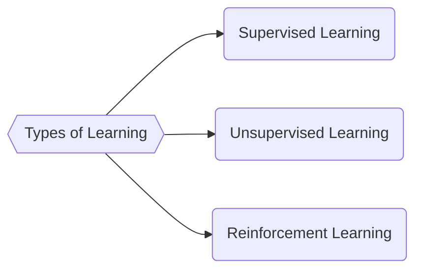

Before I explain the concept of Maximum Likelihood Estimation (MLE), I want to first introduce the notion of a hypothesis function $h_\theta$ in machine learning. The hypothesis function is a mathematical representation of the model that we are trying to learn from the data. It takes in input features and produces an output prediction based on the learned parameters $\theta$.

## Notion of Hypothesis $h_\theta$

    <canvas id="hypothesisFunctionCanvas" width="710" height="300" style="max-width:100%;display:block;margin:2rem auto;"></canvas>
    

Assume that there exists a dataset with $N$ data points, where $x_i \in \mathbb{R}^m$ is a vector of input features for the $i$-th data point, and $y_i \in \mathbb{R}^n$ is the corresponding output variable, mapped by some underlying function $f$. Then,
$$
    f: \mathbb{R}^m \rightarrow \mathbb{R}^n \qquad \text{(underlying mapping function)}
$$

And, we say that our model is a hypothesis function $h_\theta$ that approximates the underlying function $f$. The hypothesis function is parameterized by a set of parameters $\theta$, which we aim to learn from the data.

$$
    h_\theta: \mathbb{R}^m \rightarrow \mathbb{R}^n \qquad \text{(hypothesis function $h_\theta \approx f$)}
$$

### Types of Learning

Depending upon the problem we are trying to solve, the algorithm for training a model can vary. In some cases, we might have the output data to match up with our hypothesis, and in other cases, we might not have it completely. This leads us to the different types of learning in machine learning. The three main types of learning are supervised learning, unsupervised learning, and reinforcement learning.

```mermaid
graph LR
    A{{"Types of Learning"}} --> B("Supervised Learning")
    A --> C("Unsupervised Learning")
    A --> D("Reinforcement Learning")
```

1. **Supervised learning** — In supervised learning, we have a dataset that contains both input features and output labels. The goal is to learn a mapping from the input features to the output labels. This is the most common type of learning in machine learning.
2. **Unsupervised learning** — In unsupervised learning, we have a dataset that contains only input features and no output labels. The goal is to learn the underlying structure of the data. This type of learning is less common than supervised learning, but it is still an important area of research.
3. **Reinforcement learning** — In reinforcement learning, there are no labeled input-output pairs. Instead, an agent learns by interacting with an environment and receiving feedback in the form of rewards or penalties. The goal is to learn a policy that maximizes the cumulative reward over time. This type of learning is widely used in robotics, game playing, and sequential decision-making problems. I will touch upon this type of learning in a future post, but for now, we will focus on supervised and unsupervised learning.

### Training loop — optimizing the model parameters

The training loop is the process of iteratively updating the model parameters to minimize the loss function. The loss function measures how well the model's predictions match with the actual output data. As we minimize the loss function by adjusting the model parameters, we move closer to a model that accurately represents the underlying data distribution. The exact details of input features, labels, optimisation algorithms, loss functions can vary depending on the problem we are trying to solve, but the overall idea remains the same. We want to find a set of model parameters that minimize the loss function and produce accurate predictions on unseen data.

    <canvas id="trainingLoopCanvas" width="710" height="300" style="max-width:100%;display:block;margin:2rem auto;"></canvas>
    

Here's a breakdown of the steps in the training loop:

1. **Forward pass ($\hat{y}_i = h_\theta(x_i)$)** — The process of passing the input features through the hypothesis function to obtain the predicted output. This is where we use our current model parameters to make predictions on the input data.
2. **Compute Loss ($L(\hat{y}_i, y_i)$)** — A measure of how well the model's predictions match the actual output data. The goal of training is to minimize this loss function by updating the model parameters.
3. **Update parameters of the model ($\theta \leftarrow \theta - \alpha \nabla L$)** — The process of adjusting the model parameters based on the gradient of the loss function with respect to the parameters. This is done using an optimization algorithm such as gradient descent, where $\alpha$ is the learning rate that controls the step size of the updates.

> Note: Typically, we first collect a dataset from the real world, and then we split it into a training set and a testing set. The training set is then used to train the model, while the testing set is used to evaluate its performance. 

We do the splitting of the dataset to get an unbiased estimate of how well the model generalizes to unseen data. By keeping the testing set separate and never using it during training, we can evaluate the model's true generalization performance. This also allows us to *detect* overfitting — if the model performs well on the training set but poorly on the test set, it is a sign that the model has overfit to the training data. However, the split itself does not prevent overfitting; addressing overfitting requires other techniques such as regularization, early stopping, or collecting more data.

### Maximum Likelihood Estimation (MLE) and deriving the loss function

Now, a natural question arises: What is the loss function and how do we learn the parameters $\theta$ of our hypothesis function $h_\theta$? The answer lies in the concept of **Maximum Likelihood Estimation (MLE)** and **Gradient Descent algorithm**.

What do I mean by Likelihood? In statistics, the [likelihood](https://en.wikipedia.org/wiki/Likelihood_function) function is a function of the parameters of a statistical model that describes the probability of observing the given data. In other words, it measures how likely it is to observe the data given a set of parameters.

If $x_i$ is the input features and $y_i$ is the corresponding output variable for the $i$-th data point, we can express the likelihood of the parameters $\theta$ given the data as:
\begin{align*}
    L(\theta) &= p(y_1, y_2, ..., y_N \mid x_1, x_2, ..., x_N;\theta)
\end{align*}

It can be seen that maximizing the likelihood function is equivalent to finding the parameters $\theta$ that make the observed data most probable. In other words, we want to find the parameters that maximize the probability of observing the data we have collected.
\begin{align*}
    \hat{\theta} &= \arg\max_\theta L(\theta) = \arg\max_\theta \, p(y_1, y_2, ..., y_N \mid x_1, x_2, ..., x_N;\theta)
\end{align*}

This method of maximizing the input-output probability by tweaking parameters is called **Maximum Likelihood Estimation (MLE)**.

But why bother ourselves with this formulation? The key advantage is that it provides a principled way of deriving the loss function for our model. Moreover, maximizing the likelihood of the observed data is equivalent to minimizing the negative log-likelihood (NLL), which is the loss function used in many machine learning algorithms.

Before I proceed further, I want to highlight one **key assumption** that we make in MLE:

> **Assumption (i.i.d.):** The observations $(x_i, y_i)$ are drawn independently from the same underlying distribution. This means the conditional probability $p(y_i \mid x_i; \theta)$ for each data point does not depend on any other data point in the dataset.

So the likelihood of the entire dataset can be expressed as:
$$
    p(y_1, y_2, ..., y_N \mid x_1, x_2, ..., x_N;\theta) = \prod_{i=1}^{N} p(y_i \mid x_i;\theta)
$$

Now, since we want to maximize this likelihood, we can take $\log$ of this expression and then take the $\arg\max$ with respect to $\theta$ to find the optimal parameters that maximize the likelihood of the observed data: 

    
Why take the logarithm? Click to expand

    

    Two main reasons for taking the logarithm of the likelihood function are:
    1. **Numerical stability** — The likelihood function can be very small for large datasets, which can lead to numerical underflow when multiplying many probabilities together. Taking the logarithm of the likelihood function transforms the product into a sum, which is more numerically stable and easier to compute.
    2. **Computational efficiency** — Maximizing the product of probabilities can be computationally expensive, especially when dealing with large datasets. Taking the logarithm of the likelihood function transforms the product into a sum, which is computationally more efficient and easier to optimize.
    
    $$
        \hat{\theta} = \arg\max_\theta \, p(y_1, y_2, ..., y_N \mid x_1, x_2, ..., x_N;\theta) = \arg\max_\theta \, \prod_{i=1}^{N} p(y_i \mid x_i;\theta)
    $$
    
    Moreover, taking $\log$ is a monotonic transformation that preserves the location of the maximum. In other words, the value of $\theta$ that maximizes the likelihood function is the same as the value of $\theta$ that maximizes the log-likelihood function. 
    
    This is because the logarithm is a strictly increasing function, which means that if $a > b$, then $\log(a) > \log(b)$. Therefore, taking the logarithm of the likelihood function does not change the location of the maximum, but it does make the optimization problem easier to solve.

This leads us to the log-likelihood function, where $\hat{\theta}$ is the set of parameters that maximizes the log-likelihood function:
\begin{align*}
    \hat{\theta} &= \arg\max_\theta \, \log p(y_1, y_2, ..., y_N \mid x_1, x_2, ..., x_N;\theta)\\ 
                 &= \arg\max_\theta \, \log \prod_{i=1}^{N} p(y_i \mid x_i;\theta)\\
                 &= \arg\max_\theta \, \sum_{i=1}^{N} \log p(y_i \mid x_i;\theta)
\end{align*}

In the subsequent posts, we will explore how MLE can be used to derive loss functions for other types of models, such as logistic regression and neural networks. So, stay tuned for more insights into the fascinating world of machine learning!

